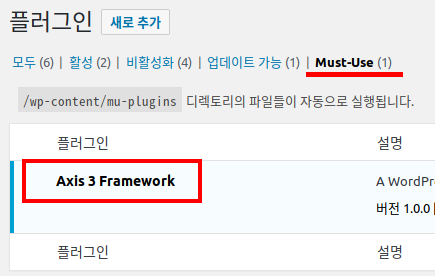
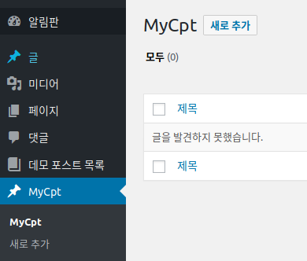

# Axis3

* Axis3 소개
* 시작하기
    * 설치하기
        * composer 설치
        * 소스 다운로드
        * 셋업
    * 플러그인 작성
        * composer.json 설정
        * Autoloader 설정
        * 플러그인 소스 코드 구조
        * 기본 코드 작성
    * 커스텀 포스트 만들기
        * 파라미터 넣기
        * 커스텀 필드 추가
    * 커스텀 택소노미 만들기
        * 파라미터 작성
    * 설정 페이지 만들기
        * 옵션 설정하기
        * 옵션 페이지 만들기
* Axis 콤포넌트
    * 개시자
        * 오브젝트 캐싱
    * 클래스 검색자
        * 모델과 전수자의 검색 설정
    * 전수자
        * 전수자에서 액션과 필터 설정
        * 자동 전수자
        * 전수자와 문맥
        * 전수자에서 뷰로 콜백 위임
        * 유용한 전수자
            * 모델 자동 등록 전수자
            * 관리 화면 전수자
    * 모델
        * 필드 모델
            * 메타 필드 모델
            * 옵션 필드 모델
        * 값 타입
            * 문자열 타입
            * 정수 타입
            * 실수 타입
            * 날짜 시간 타입
            * 배열 타입
            * IP 타입
            * 객체값 타입
            * 더미 타입
            * 새로운 값 타입 만들기
        * 커스텀 포스트
        * 커스텀 택소노미
        * 역할과 권한
        * 커스텀 필드
        * 옵션 필드
    * 뷰
        * 위임된 전수자 처리
        * 뷰와 템플릿
        * 필드 위젯 뷰
            * 입력상자 (&lt;input&gt;) 위젯
            * 선택상자 (&lt;select&gt;) 위젯
            * 체크박스 위젯
            * 체크박스/라디오 위젯
            * 날짜 선택 위젯
            * 텍스트영역 (&lttextarea&gt;) 위젯
            * 일반 위젯
            * 새로운 필드 위젯 만들기
        * 유용한 뷰
            * 탭 뷰
            * 섹션 뷰
            * 메타 박스 뷰
            * 속성 메타 박스 뷰
            * 쇼트코드 뷰
            * 셋팅 뷰
            * 메뉴 페이지 뷰
            * 서브메뉴 페이지 뷰
* Axis 확장
    * CLI (Command Line Interface)
    * 플러그인 구조 리포팅  


## Axis3 소개 
Axis3 (액시스 3)는 워드프레스 플러그인 형태의 프레임워크로서 다른 플러그인의 코드 작성을 지원하기 위하여 개발되었습니다.
Axis3를 사용하면 보다 객체지향적으로 플러그인을 구성할 수 있으면, 고수준의 데이터 처리 뿐 아니라 프레임워크가 기본적으로
제공하는 편리하고 강건한 기능들을 다시 개발할 필요 없이 그대로 가져와 재사용이 가능합니다.
Axis3가 제안하는 플러그인의 구성에 기반하여 플러그인을 작성하면 플러그인의 형태와 구성이 
일관적으로 유지될 수 있습니다. 또한 Axis3는 모던 PHP 코딩을 지향합니다. 
PSR-1, 2, 4 등을 이용한 코드 스타일 및 모듈 오토로딩을 활용하여 손쉬운 모듈화 및 확장이 가능합니다. 


## Axis3 사용 환경
* 워드프레스 사용 환경 (Apache, or Nginx - PHP - MySQL)
* PHP 7.0 이상.

## 개발 권장 사항
Axis3 개발은 사실 에디터에 구애받지는 않습니다. 그러나 보다 편안한 개발 진행을 위해서는 에디터가 
아래 나열한 기능들이 잘 지원되지 확인하세요.

* **PHP 자동 임포트**
  
  Axis3 기반으로 프로그래밍을 하면 굉장히 자주 'use' 키워드를 사용해야 합니다.
  이 때 일일이 use 키워드를 손으로 작성하려면 코드 작성의 흐름을 방해 받아 좋지 않습니다.
  에디터가 Axis3 구조를 미리 파악하고 적절한 클래스를 찾아 소스 코드에 use 구문을 작성해 주면 훨씬 도움이 됩니다.

* **변수, 메소드 가이드** 

  에디터가 작성된 메소드, 함수, 변수, 속성등을 파악하여 코드시 확인할 수 있도록 도움을 줄 수 있으면 
  코드 작성시 능률이 훨씬 올라갑니다. 사용하는 것을 추천합니다. 

* **구문 검사 기능**

  개발 중 제대로 notice 메시지나 warning 메시지를 인지하고 진행하시나요? 이런 것들이 발행하는지 미리 알 수 있게
  도움을 주는 에디터를 권장합니다.  


## 시작하기
Axis3를 이용해 플러그인을 작성해 봅니다. 설치하고 간단한 플러그인을 작성해 보면서 Axis3의 기본적인 기능을 이해해 보세요. 

### Composer 설치
[Composer](https://getcomposer.org/download/)를 다운로드하여 설치하세요.
환경 변수에 등록하여 어디서든 composer 명령이 동작하는지 확인하세요. 아래와 비슷하게 나오는지 확인하여 설치를 마무리합니다.

```shell script
composer --version
# Composer 1.6.3 2018-01-31 16:28:17 # 출력 결과는 이 줄과 비슷합니다.
```

### Axis3 소스 다운로드 및 설치
[git](https://git-scm.com/downloads)를 사용하여 소스를 클론하거나 마스터 브랜치를 다운로드합니다.
소스코드는 워드프레스의 M.U. (Must Use) 플러그인 디렉토리에 놓아 둡니다.

### Axis3 플러그인 설치
워드프레스의 테마는 보통 `wp-content/themes`, 플러그인은 `wp-content/plugins` 디렉토리에 둡니다.
mu 플러그인은 `wp-content/mu-plugins` 디렉토리에 놓아두며, 보통은 생성되어 있지 않습니다. 디렉토리가 없다면
`wp-content` 디렉토리에 `mu-plugins` 디렉토리를 생성하고 여기에 `axis3` 디렉토리를 놓아 두면 됩니다.

mu 플러그인은 통상 플러그인과는 달리 활성화, 비활성화가 존재하지 않습니다. `wp-content/mu-plugins` 에 두면
무조건 실행됩니다. 또 mu 플러그인은 통상적인 플러그인이 흔히 쓰는 서브폴더 안에 플러그인 소스를 두는 것을 허용하지 않습니다.
그러므로 axis3 소스를 코어가 인식하려면 *로더 스크립트*를 별도로 만들어 `mu-plugins` 디렉토리에 작성해야 합니다.

아래는 `axis3-loader.php` 파일의 간단한 예제입니다.
이 파일을 `wp-content/mu-plugins`에 두고 axis3 소스를 `wp-content/mu-plugins/axis3`에 둡니다.

```php
<?php
/**
 * Plugin Name: Axis 3 Framework
 */
require_once __DIR__ . '/axis3/axis3.php';
```

이렇게 하고 관리자화면 플러그인 메뉴에서 보면 'Must-Use'라는 항목이 보이고 axis3가 인식되어 있는 것을 알 수 있습니다.




### 플러그인 작성
예제 플러그인 `wp-content/plugins/my-plugin/my-plugin.php`을 생성합니다.

#### composer.json 설정
`wp-content/plugins/my-plugin/composer.json` 예제입니다.

```json
{
  "name": "my-name/my-plugin",
  "type": "wordpress-plugin",
  "require": {},
  "autoload": {
    "psr-4": {
      "MyName\\MyPlugin\\": "src/"
    },
    "files": [
      "src/Functions/Startup.php"
    ]
  },
  "license": "GPL-2.0+",
  "authors": [
    {
      "name": "my-name",
      "email": "my-email@email.com"
    }
  ]
}
```

#### 메인 파일
```php
<?php
/**
 * Plugin Name: 예제 플러그인
 * Description: Axis3 프레임워크를 이해하기 위한 기본적인 기능을 소개합니다.
 * License:     GPLv2 or later
 * Version:     1.0.0
 */

require_once __DIR__ . '/vendor/autoload.php';

define('MY_PLUGIN_MAIN', __FILE__);
define('MY_PLUGIN_VERSION', '1.0.0');

try {
    $args = [
        'mainFile'  => MY_PLUGIN_MAIN,
        'version'   => MY_PLUGIN_VERSION,
        'namespace' => 'MyName\\MyPlugin\\',
        'prefix'    => 'my_plugin',
    ];
    Shoplic\Axis3\Starters\Starter::factory($args)->start();
} catch (Exception $e) {
    wp_die($e->getMessage());
}
```

기본적인 구성을 사용하면 `Shoplic\Axis3\Starters\Starter::factory()` 메소드를 이용해 손쉽게 개시자(Starter)를 
생성할 수 있습니다. 이 메소드는 배열을 필요로 하는데, 배열에는 'mainFile', 'version', 'namespace' 키를 필수로 합니다.
그리고 예제에서는 플러그인의 접두어를 별도로 지정했습니다. 여기서 접두어는 'my_plugin'으로, 이렇게 하면 플러그인은
모든 메타 키, 옵션의 이름 앞에 'my_plugin_'을 붙입니다. 접두어를 통해 데이터베이스 테이블에서 쉽게 플러그인이 생성한
레코드임을 식별할 수 있습니다. 'my_plugin'을 입력할 때는 뒤에 언더바(_)가 붙는 것은 생략해도 됩니다.
 
마마지막으로 스타터를 시동합니다. 시동은 `start()` 메소드입니다. 만약 에러가 나면 wp_die()에서 워드프레스 시동이 
중단되고 에러 메시지가 출력될 것입니다. 
 

#### Dump Autoload
웹브라우저로 워드프레스 사이트에 접속하면 에러가 날 수 있습니다.
왜냐면 아직 vendor/autoload.php 파일을 생성하지 않았는데 require_once 구문으로 autoload.php 파일을 가져오려고
하기 때문입니다. 다음 명령으로 autoload 관련 파일이 자동 생성되도록 합니다.
```
composer dump-autoload
```
`wp-content/plugins/my-plugin/vendor/autoload.php` 파일이 생성된 것을 확인하세요. 
이제 정상적으로 워드프레스의 화면이 나올 겁니다.

#### 커스텀 포스트 만들기
이제 커스텀 포스트를 작성해 봅니다. 커스텀 포스트는 Axis3의 CustomPostModel 클래스를 상속받아 만듭니다.
앞서 모델은 AutoDiscoverClassFinder 클래스를 이용해 자동 검색하도록 한 것을 기억하신가요? 
Axis3의 자동 검색은 이렇게 생성한 커스텀 포스트는 코어에 자동으로 등록 처리합니다.
`wp-content/plugins/my-plugin/src/Models/MyCptModel.php` 파일을 만들고 다음과 같이 작성합니다.

```php
<?php
/**
 * my-plugin/src/Models/MyCptModel.php
 */
namespace MyName\MyPlugin\Models;

use Shoplic\Axis3\Models\CustomPostModel;

class MyCptModel extends CustomPostModel
{
    public static function getPostType(): string
    {
        return 'my_cpt';
    }

    public function getPostTypeArgs(): array
    {
        return [
            'label'  => 'MyCpt',
            'public' => true,
        ];
    }
}
```
복잡한 파라미터는 제외하고 가장 필수적인 요소만 선보였습니다. 잘 보면
[register_post_type()](https://codex.wordpress.org/Function_Reference/register_post_type) 함수의 
각 파라미터를 메소드로 분리한 것임을 알 수 있습니다.
첫번째 인자는 `getPostType()`, 두번째는 `getPostTypeArgs()`에 대응됩니다.
`getPostType()`은 정적 메소드로 어디서든 `MyCptModel::getPostType()`로 얻을 수 있습니다. 코드 힌트의 도움을 얻으면 
일일이 커스텀 포스트 이름 문자열을 기억하지 않아도 되어 편리합니다.

관리자 화면에서 'MyCpt'가 나오는 것을 확인합니다.



#### 커스텀 필드 추가
커스텀 포스트를 클래스로 관리하는 것의 이점은 커스텀 포스트와 관련된 코드를 한 클래스에서 집중적으로 관리할 수 있다는
것입니다. 포스트를 정의하고, 포스트의 커스텀 필드도 한 클래스에서 정의합니다. 이로 인해 포스트와 포스트 메타의 관계가
보다 분명하게 파악됩니다.

Axis3는 그에 더해 강력한 메타 필드 모델을 제공합니다. Axis3는 일관된 메타 필드 키의 정의하도록 하고, 
필드의 값 타입을 명확하게 정의하도록 유도합니다. 각 커스텀 필드는 일관된 규칙을 가진 메소드 하에 모델링됩니다.
각 커스텀 필드를 사용하기 위해 키 문자열이 아닌 클래스 메소드를 사용하므로 보다 빠르게 사용이 가능합니다.

`MyCpt` 클래스의 아랫쪽에 다음과 같이 코드를 추가합니다.

```php
<?php 
/**
 * my-plugin/src/Models/MyCptModel.php
 */
namespace MyName\MyPlugin\Models;

use Shoplic\Axis3\Models\CustomPostModel;
use Shoplic\Axis3\Models\ValueTypes\BoolType;
use Shoplic\Axis3\Models\ValueTypes\DatetimeType;
use Shoplic\Axis3\Models\ValueTypes\DoubleType;
use Shoplic\Axis3\Models\ValueTypes\IntType;
use Shoplic\Axis3\Models\ValueTypes\TextType;

class MyCptModel extends CustomPostModel
{
    /** ... 생략 ... */

    public function getFieldMyTextField()
    {
        return $this->claimMetaFieldModel(
            $this->guessKey(__METHOD__),
            function () {
                return [
                    'label'       => 'My Text',
                    'description' => 'My text field',
                    'valueType'   => new TextType(),
                ];
            }
        );
    }

    public function getFieldMyBoolField()
    {
        return $this->claimMetaFieldModel(
            $this->guessKey(__METHOD__),
            function () {
                return [
                    'label'       => 'My Bool',
                    'description' => 'My boolean field',
                    'valueType'   => new BoolType(),
                ];
            }
        );
    }

    public function getFieldMyIntField()
    {
        return $this->claimMetaFieldModel(
            $this->guessKey(__METHOD__),
            function () {
                return [
                    'label'       => 'My Int',
                    'description' => 'My integer field',
                    'valueType'   => new IntType(),
                ];
            }
        );
    }

    public function getFieldMyDoubleField()
    {
        return $this->claimMetaFieldModel(
            $this->guessKey(__METHOD__),
            function () {
                return [
                    'label'       => 'My Double',
                    'description' => 'My double field',
                    'valueType'   => new DoubleType(),
                ];
            }
        );
    }

    public function getFieldMyDatetimeField()
    {
        return $this->claimMetaFieldModel(
            $this->guessKey(__METHOD__),
            function () {
                return [
                    'label'       => 'My Datetime',
                    'description' => 'My datetime field',
                    'valueType'   => new DatetimeType(),
                ];
            }
        );
    }
} 
```      

총 5개의 메소드가 추가되었습니다. 자세히 보면 모두 매우 유사한 패턴으로 작성된 것을 볼 수 있습니다.
각각 텍스트, 불리언, 정수, 실수, 날짜 타입의 커스텀 필드를 정의한 것입니다.

```php
<?php 
public function getFieldMyTextField()
{
    return $this->claimMetaFieldModel(
        $this->guessKey(__METHOD__),
        function () {
            return [
                'label'       => 'My Text',
                'description' => 'My text field',
                'valueType'   => new TextType(),
            ];
        }
    );
}
```

`$this->claimMetaFieldModel()`은 이 포스트 타입에 속하는 메타 필드 모델 인스턴스를 생성합니다.
인자로 두개가 입력됩니다. 첫번째는 `$this->guessKey(__METHOD__)`이고 두번째는 익명함수입니다.
첫번째 인자는 사실 메타 키 문자열을 입력하는 부분입니다. 그러나 이렇게 `$this->guessKey(__METHOD__)`
라고 적으면 현재 메소드 이름인 `getFieldMyTextField`로부터 메타 필드 이름을 자동으로 추측하게 됩니다.

메소드 이름은 다음 방법을 통해 메타 키로 변환됩니다.
1. 'getField' 부분은 제거합니다.
2. 파스칼 스타일인 'MyTextField'는 스네이크 스타일인 'my_text_field'로 변환됩니다.
3. 키의 가장 앞에 플러그인의 접두어가 붙습니다. 
   앞서 `my-plugin.php` 파일에서 `$starter->setPrefix('my_plugin');` 같이 접두어를 설정했습니다.
4. 그러므로 메타 키는 'my_plugin_my_text_field'가 됩니다.

두번째 인자는 익명함수로 배열을 리턴합니다. 이 배열은 메타필드 모델을 정의할 때 사용되는 인자들입니다.
이 중 'valueType'인자는 필수적으로 이 모델의 값이 어떤 타입인지 명시하는 역할을 맡습니다
'label', 'description'은 이 모델에 대한 설명으로 이 모델이 어떤 일을 하는지 서술하는 역할을 맡습니다.

#### 메타박스를 이용해 커스텀 필드 출력


#### 커스텀 택소노미 만들기
##### 파라미터
* 설정 페이지 만들기
    * 옵션 설정하기
    * 옵션 페이지 만들기