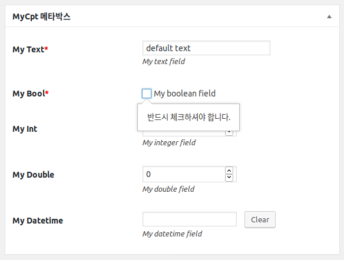

# Axis3

* Axis3 소개
* 시작하기
    * 설치하기
        * composer 설치
        * 소스 다운로드
        * 셋업
    * 플러그인 작성
        * composer.json 설정
        * Autoloader 설정
        * 플러그인 소스 코드 구조
        * 기본 코드 작성
    * 커스텀 포스트 만들기
        * 파라미터 넣기
        * 커스텀 필드 추가
    * 커스텀 택소노미 만들기
        * 파라미터 작성
    * 설정 페이지 만들기
        * 옵션 설정하기
        * 옵션 페이지 만들기
* Axis 콤포넌트
    * 개시자
        * 오브젝트 캐싱
    * 클래스 검색자
        * 모델과 전수자의 검색 설정
    * 전수자
        * 전수자에서 액션과 필터 설정
        * 자동 전수자
        * 전수자와 문맥
        * 전수자에서 뷰로 콜백 위임
        * 유용한 전수자
            * 모델 자동 등록 전수자
            * 관리 화면 전수자
    * 모델
        * 필드 모델
            * 메타 필드 모델
            * 옵션 필드 모델
        * 값 타입
            * 문자열 타입
            * 정수 타입
            * 실수 타입
            * 날짜 시간 타입
            * 배열 타입
            * IP 타입
            * 객체값 타입
            * 더미 타입
            * 새로운 값 타입 만들기
        * 커스텀 포스트
        * 커스텀 택소노미
        * 역할과 권한
        * 커스텀 필드
        * 옵션 필드
    * 뷰
        * 위임된 전수자 처리
        * 뷰와 템플릿
        * 필드 위젯 뷰
            * 입력상자 (&lt;input&gt;) 위젯
            * 선택상자 (&lt;select&gt;) 위젯
            * 체크박스 위젯
            * 체크박스/라디오 위젯
            * 날짜 선택 위젯
            * 텍스트영역 (&lttextarea&gt;) 위젯
            * 일반 위젯
            * 새로운 필드 위젯 만들기
        * 유용한 뷰
            * 탭 뷰
            * 섹션 뷰
            * 메타 박스 뷰
            * 속성 메타 박스 뷰
            * 쇼트코드 뷰
            * 셋팅 뷰
            * 메뉴 페이지 뷰
            * 서브메뉴 페이지 뷰
* Axis 확장
    * CLI (Command Line Interface)
    * 플러그인 구조 리포팅  


## Axis3 소개 
Axis3 (액시스 3)는 워드프레스 플러그인 형태의 프레임워크로서 다른 플러그인의 코드 작성을 지원하기 위하여 개발되었습니다.
Axis3를 사용하면 보다 객체지향적으로 플러그인을 구성할 수 있으면, 고수준의 데이터 처리 뿐 아니라 프레임워크가 기본적으로
제공하는 편리하고 강건한 기능들을 다시 개발할 필요 없이 그대로 가져와 재사용이 가능합니다.
Axis3가 제안하는 플러그인의 구성에 기반하여 플러그인을 작성하면 플러그인의 형태와 구성이 
일관적으로 유지될 수 있습니다. 또한 Axis3는 모던 PHP 코딩을 지향합니다. 
PSR-1, 2, 4 등을 이용한 코드 스타일 및 모듈 오토로딩을 활용하여 손쉬운 모듈화 및 확장이 가능합니다. 


## Axis3 사용 환경
* 워드프레스 사용 환경 (Apache, or Nginx - PHP - MySQL)
* PHP 7.0 이상.


## 개발 권장 사항
Axis3 개발은 사실 에디터에 구애받지는 않습니다. 그러나 보다 편안한 개발 진행을 위해서는 에디터가 
아래 나열한 기능들이 잘 지원되지 확인하세요.

* **PHP 자동 임포트**
  
  Axis3 기반으로 프로그래밍을 하면 굉장히 자주 'use' 키워드를 사용해야 합니다.
  이 때 일일이 use 키워드를 손으로 작성하려면 코드 작성의 흐름을 방해 받아 좋지 않습니다.
  에디터가 Axis3 구조를 미리 파악하고 적절한 클래스를 찾아 소스 코드에 use 구문을 작성해 주면 훨씬 도움이 됩니다.

* **변수, 메소드 가이드** 

  에디터가 작성된 메소드, 함수, 변수, 속성등을 파악하여 코드시 확인할 수 있도록 도움을 줄 수 있으면 
  코드 작성시 능률이 훨씬 올라갑니다. 사용하는 것을 추천합니다. 

* **구문 검사 기능**

  개발 중 제대로 notice 메시지나 warning 메시지를 인지하고 진행하시나요? 이런 것들이 발행하는지 미리 알 수 있게
  도움을 주는 에디터를 권장합니다.  


## 시작하기
Axis3를 이용해 플러그인을 작성해 봅니다. 설치하고 간단한 플러그인을 작성해 보면서 Axis3의 기본적인 기능을 이해해 보세요. 

### Composer 설치
[Composer](https://getcomposer.org/download/)를 다운로드하여 설치하세요.
환경 변수에 등록하여 어디서든 composer 명령이 동작하는지 확인하세요. 아래와 비슷하게 나오는지 확인하여 설치를 마무리합니다.

```shell script
composer --version
# Composer 1.6.3 2018-01-31 16:28:17 # 출력 결과는 이 줄과 비슷합니다.
```

### Axis3 소스 다운로드 및 설치
[git](https://git-scm.com/downloads)를 사용하여 소스를 클론하거나 마스터 브랜치를 다운로드합니다.
소스코드는 워드프레스의 M.U. (Must Use) 플러그인 디렉토리에 놓아 둡니다.

### Axis3 플러그인 설치
워드프레스의 테마는 보통 `wp-content/themes`, 플러그인은 `wp-content/plugins` 디렉토리에 둡니다.
mu 플러그인은 `wp-content/mu-plugins` 디렉토리에 놓아두며, 보통은 생성되어 있지 않습니다. 디렉토리가 없다면
`wp-content` 디렉토리에 `mu-plugins` 디렉토리를 생성하고 여기에 `axis3` 디렉토리를 놓아 두면 됩니다.

mu 플러그인은 통상 플러그인과는 달리 활성화, 비활성화가 존재하지 않습니다. `wp-content/mu-plugins` 에 두면
무조건 실행됩니다. 또 mu 플러그인은 통상적인 플러그인이 흔히 쓰는 서브폴더 안에 플러그인 소스를 두는 것을 허용하지 않습니다.
그러므로 axis3 소스를 코어가 인식하려면 *로더 스크립트*를 별도로 만들어 `mu-plugins` 디렉토리에 작성해야 합니다.

아래는 `axis3-loader.php` 파일의 간단한 예제입니다.
이 파일을 `wp-content/mu-plugins`에 두고 axis3 소스를 `wp-content/mu-plugins/axis3`에 둡니다.

```php
<?php
/**
 * Plugin Name: Axis 3 Framework
 */
require_once __DIR__ . '/axis3/axis3.php';
```

이렇게 하고 관리자화면 플러그인 메뉴에서 보면 'Must-Use'라는 항목이 보이고 axis3가 인식되어 있는 것을 알 수 있습니다.


### 플러그인 작성
예제 플러그인은 `wp-content/plugins/my-plugin/my-plugin.php`을 메인 파일로 합니다.
특별한 기능알 목표로 하는 것은 아니지만, axis3 기반의 플러그인은 이러한 구조를 가질 수 있다는 것을 보이는 
예시라고 생각하시면 됩니다.


#### composer.json 설정
`wp-content/plugins/my-plugin/composer.json` 예제입니다.

```json
{
  "name": "my-name/my-plugin",
  "type": "wordpress-plugin",
  "require": {},
  "autoload": {
    "psr-4": {
      "MyName\\MyPlugin\\": "src/"
    },
    "files": [
      "src/Functions/Startup.php"
    ]
  },
  "license": "GPL-2.0+",
  "authors": [
    {
      "name": "my-name",
      "email": "my-email@email.com"
    }
  ]
}
```

#### 메인 파일

```php
<?php
/**
 * Plugin Name: 예제 플러그인
 * Description: Axis3 프레임워크를 이해하기 위한 기본적인 기능을 소개합니다.
 * License:     GPLv2 or later
 * Version:     1.0.0
 */

require_once __DIR__ . '/vendor/autoload.php';

define('MY_PLUGIN_MAIN', __FILE__);
define('MY_PLUGIN_VERSION', '1.0.0');

try {
    $args = [
        'mainFile'  => MY_PLUGIN_MAIN,
        'version'   => MY_PLUGIN_VERSION,
        'namespace' => 'MyName\\MyPlugin\\',
        'prefix'    => 'my_plugin',
    ];
    Shoplic\Axis3\Starters\Starter::factory($args)->start();
} catch (Exception $e) {
    wp_die($e->getMessage());
}
```

기본적인 구성을 사용하면 `Shoplic\Axis3\Starters\Starter::factory()` 메소드를 이용해 손쉽게 개시자(Starter)를 
생성할 수 있습니다. 이 메소드는 배열을 필요로 하는데, 배열에는 'mainFile', 'version', 'namespace' 키를 필수로 합니다.
그리고 예제에서는 플러그인의 접두어를 별도로 지정했습니다. 여기서 접두어는 'my_plugin'으로, 이렇게 하면 플러그인은
모든 메타 키, 옵션의 이름 앞에 접두어 'my_plugin_'을 붙입니다. 접두어를 통해 데이터베이스 테이블에서
쉽게 플러그인이 생성한 레코드임을 식별할 수 있습니다. 접두어 'my_plugin'을 입력할 때 문자열 끝의 언더바는
생략해도 됩니다.
 
마지막으로 스타터를 시동합니다. 시동은 `start()` 메소드입니다. 만약 에러가 나면 wp_die()에서 워드프레스 시동이 
중단되고 에러 메시지가 출력될 것입니다. 
 

#### Dump Autoload
웹브라우저로 워드프레스 사이트에 접속하면 에러가 날 수 있습니다.
왜냐면 아직 vendor/autoload.php 파일을 생성하지 않았는데 require_once 구문으로 autoload.php 파일을 가져오려고
하기 때문입니다. 다음 명령으로 autoload 관련 파일이 자동 생성되도록 합니다.
```
composer dump-autoload
```
`wp-content/plugins/my-plugin/vendor/autoload.php` 파일이 생성된 것을 확인하세요. 
이제 정상적으로 워드프레스의 화면이 나올 겁니다.

#### 커스텀 포스트 만들기
이제 커스텀 포스트를 작성해 봅니다. 커스텀 포스트는 Axis3의 CustomPostModel 클래스를 상속받아 만듭니다.
Axis3는 플러그인의 디렉토리를 자동 검색하여 커스텀 포스트는 코어에 자동으로 등록 처리합니다.
`wp-content/plugins/my-plugin/src/Models/MyCptModel.php` 파일을 만들고 다음과 같이 작성합니다.

```php
<?php
/**
 * my-plugin/src/Models/MyCptModel.php
 */
namespace MyName\MyPlugin\Models;

use Shoplic\Axis3\Models\CustomPostModel;

class MyCptModel extends CustomPostModel
{
    public static function getPostType(): string
    {
        return 'my_cpt';
    }

    public function getPostTypeArgs(): array
    {
        return [
            'label'  => 'MyCpt',
            'public' => true,
        ];
    }
}
```
복잡한 파라미터는 제외하고 가장 필수적인 요소만 선보였습니다. 잘 보면
[register_post_type()](https://codex.wordpress.org/Function_Reference/register_post_type) 함수의 
각 파라미터를 메소드로 분리한 것임을 알 수 있습니다.
첫번째 인자는 `getPostType()`, 두번째는 `getPostTypeArgs()`에 대응됩니다.
`getPostType()`은 정적 메소드로 어디서든 `MyCptModel::getPostType()`로 얻을 수 있습니다. 코드 힌트의 도움을 얻으면 
일일이 커스텀 포스트 이름 문자열을 기억하지 않아도 되어 편리합니다.

관리자 화면에서 'MyCpt'가 나오는 것을 확인합니다.


#### 커스텀 필드 추가
커스텀 포스트를 클래스로 관리하는 것의 이점은 커스텀 포스트와 관련된 코드를 한 클래스에서 집중적으로 관리할 수 있다는
것입니다. 포스트를 정의하고, 포스트의 커스텀 필드도 한 클래스에서 정의합니다. 이로 인해 포스트와 포스트 메타의 관계가
보다 분명하게 파악됩니다.

Axis3는 그에 더해 강력한 메타 필드 모델을 제공합니다. Axis3는 일관된 메타 필드 키의 정의하도록 하고, 
필드의 값 타입을 명확하게 정의하도록 유도합니다. 각 커스텀 필드는 일관된 규칙을 가진 메소드 하에 모델링됩니다.
각 커스텀 필드를 사용하기 위해 키 문자열이 아닌 클래스 메소드를 사용하므로 보다 빠르게 사용이 가능합니다.

`MyCpt` 클래스의 아랫쪽에 다음과 같이 코드를 추가합니다.

```php
<?php 
/**
 * my-plugin/src/Models/MyCptModel.php
 */
namespace MyName\MyPlugin\Models;

use Shoplic\Axis3\Models\CustomPostModel;
use Shoplic\Axis3\Models\ValueTypes\BoolType;
use Shoplic\Axis3\Models\ValueTypes\DatetimeType;
use Shoplic\Axis3\Models\ValueTypes\DoubleType;
use Shoplic\Axis3\Models\ValueTypes\IntType;
use Shoplic\Axis3\Models\ValueTypes\TextType;

class MyCptModel extends CustomPostModel
{
    /** ... 생략 ... */

    public function getFieldMyTextField()
    {
        return $this->claimMetaFieldModel(
            $this->guessKey(__METHOD__),
            function () {
                return [
                    'label'       => 'My Text',
                    'description' => 'My text field',
                    'valueType'   => new TextType(),
                ];
            }
        );
    }

    public function getFieldMyBoolField()
    {
        return $this->claimMetaFieldModel(
            $this->guessKey(__METHOD__),
            function () {
                return [
                    'label'       => 'My Bool',
                    'description' => 'My boolean field',
                    'valueType'   => new BoolType(),
                ];
            }
        );
    }

    public function getFieldMyIntField()
    {
        return $this->claimMetaFieldModel(
            $this->guessKey(__METHOD__),
            function () {
                return [
                    'label'       => 'My Int',
                    'description' => 'My integer field',
                    'valueType'   => new IntType(),
                ];
            }
        );
    }

    public function getFieldMyDoubleField()
    {
        return $this->claimMetaFieldModel(
            $this->guessKey(__METHOD__),
            function () {
                return [
                    'label'       => 'My Double',
                    'description' => 'My double field',
                    'valueType'   => new DoubleType(),
                ];
            }
        );
    }

    public function getFieldMyDatetimeField()
    {
        return $this->claimMetaFieldModel(
            $this->guessKey(__METHOD__),
            function () {
                return [
                    'label'       => 'My Datetime',
                    'description' => 'My datetime field',
                    'valueType'   => new DatetimeType(),
                ];
            }
        );
    }
} 
```      

총 5개의 메소드가 추가되었습니다. 자세히 보면 모두 매우 유사한 패턴으로 작성된 것을 볼 수 있습니다.
각각 텍스트, 불리언, 정수, 실수, 날짜 타입의 커스텀 필드를 정의한 것입니다.

```php
<?php 
public function getFieldMyTextField()
{
    return $this->claimMetaFieldModel(
        $this->guessKey(__METHOD__),
        function () {
            return [
                'label'           => 'My Text',
                'description'     => 'My text field',
                'valueType'       => new TextType(),
                'default'         => 'default text',
                'required'        => true,
                'requiredMessage' => '텍스트를 필수로 입력해야 합니다.',
            ];
        }
    );
}
```

`$this->claimMetaFieldModel()`은 이 포스트 타입에 속하는 메타 필드 모델 인스턴스를 생성합니다.
인자로 두개가 입력됩니다. 첫번째는 `$this->guessKey(__METHOD__)`이고 두번째는 익명함수입니다.
첫번째 인자는 사실 메타 키 문자열을 입력하는 부분입니다. 그러나 이렇게 `$this->guessKey(__METHOD__)`
라고 적으면 현재 메소드 이름인 `getFieldMyTextField`로부터 메타 필드 이름을 자동으로 추측하게 됩니다.

메소드 이름은 다음 방법을 통해 메타 키로 변환됩니다.
1. 'getField' 부분은 제거합니다.
2. 파스칼 스타일인 'MyTextField'는 스네이크 스타일인 'my_text_field'로 변환됩니다.
3. 키의 가장 앞에 플러그인의 접두어가 붙습니다. 
   앞서 `my-plugin.php` 파일에서 `$starter->setPrefix('my_plugin');` 같이 접두어를 설정했습니다.
4. 그러므로 메타 키는 'my_plugin_my_text_field'가 됩니다.

두번째 인자는 익명함수로 배열을 리턴합니다. 이 배열은 메타필드 모델을 정의할 때 사용되는 인자들입니다.
이 중 'valueType'인자는 필수적으로 이 모델의 값이 어떤 타입인지 명시하는 역할을 맡습니다
'label', 'description'은 이 모델에 대한 설명으로 이 모델이 어떤 일을 하는지 서술하는 역할을 맡습니다.
메타 값이 발견되지 않는 경우 기본값을 제시하기 위한 'default'인자가 있으며,
이 필드는 필수입니다. 또한 별도의 필수 메시지를 지정하였습니다.

Axis3에서는 이렇게 각각 필드마다 타입을 명시하도록 되어 있습니다. 이렇게 하는 이뉴는 타입 저글링이 빈번하게 일어나는
PHP 코드에서 보다 엄격하게 타입을 제한하기 위함입니다. 메타 필드는 데이터베이스에서 모두 문자열로 저장됩니다.
그러므로 모든 메타 필드는 불려질 때 문자열입니다. 그리고 나중에 코드에 의해 각각 타입으로 변환됩니다.
그런데 이런 구조에서는 매번 타입을 체크하는 코드를 작성해야 되어 번거럽고, 또 실수로 타입 체크 및 확인을 누락하면 
때때로 코드에서 버그를 일으키는 원인이 됩니다. 이를 미연에 방지하기 위해 불러올 때 반드시 지정한 타입으로 변환하여 
불러오도록 합니다.
  

#### 메타박스를 이용해 커스텀 필드 출력

이제 생성한 메타박스를 관리자 화면으로 출력합니다. 메타박스 출력을 위해 Axis3는 `PropertyMetaBoxView`라는 뷰 클래스를
제공합니다. 이 클래스는 메타박스를 생성하기 위한 클래스이며, HTML 코딩을 반복하지 않아도 일정한 폼 테이블을 간편하게 
출력할 수 있도록 합니다.

또한 커스텀 포스트의 관리자 화면을 필요에 맞게 변경하기 위해 `CustomPostAdminInitiator`라는 전수자(Initiator) 클래스도
제공됩니다. 반복되는 커스텀 포스트 관리자 화면 목록/싱글 페이지의 여러 요소를 제어하기 위해 제공됩니다. 

```php
<?php 
/** my-plugin/src/Initiators/Admin/MyCptAdminInitiator.php */


namespace MyName\MyPlugin\Initiators\Admin;

use MyName\MyPlugin\Models\MyCptModel;
use MyName\MyPlugin\Views\Admin\MetaBoxes\MyCptMetaBoxView;
use Shoplic\Axis3\Initiators\Admin\CustomPostAdminInitiator as CptInitiator;
use Shoplic\Axis3\Interfaces\Models\CustomPostModelInterface;

class MyCptAdminInitiator extends CptInitiator
{
    public function setup($args = array())
    {
        $this
            // 메타박스
            ->enableKeyword(CptInitiator::KEY_ACTION_ADD_META_BOXES)
            ->addMetaBoxView(MyCptMetaBoxView::class)
            // 저장
            ->enableKeyword(CptInitiator::KEY_ACTION_SAVE_POST);
    }

    public function getModel(): CustomPostModelInterface
    {
        /** @var MyCptModel $model */
        $model = $this->claimModel(MyCptModel::class);

        return $model;
    }
}
```

```php
<?php
/** my-plugin/src/Views/Admin/MetaBoxes/MyCptMetaBoxView.php */


namespace MyName\MyPlugin\Views\Admin\MetaBoxes;

use MyName\MyPlugin\Models\MyCptModel;
use Shoplic\Axis3\Views\Admin\FieldWidgets\CheckboxWidget;
use Shoplic\Axis3\Views\Admin\FieldWidgets\DatePickerWidget;
use Shoplic\Axis3\Views\Admin\FieldWidgets\InputWidget;
use Shoplic\Axis3\Views\Admin\PropertyMetaBoxView;

class MyCptMetaBoxView extends PropertyMetaBoxView
{
    public function getId(): string
    {
        return 'my-cpt-meta';
    }

    public function getTitle(): string
    {
        return 'MyCpt 메타박스';
    }

    public function getFieldWidgets($post): array
    {
        /** @var MyCptModel $model */
        $model = $this->claimModel(MyCptModel::class);

        return [
            new InputWidget($model->getFieldMyTextField()),
            new CheckboxWidget($model->getFieldMyBoolField()),
            new InputWidget(
                $model->getFieldMyIntField(),
                [
                    'attrs' => [
                        'type' => 'number',
                        'min'  => 1,
                        'max'  => 10,
                    ],
                ]
            ),
            new InputWidget(
                $model->getFieldMyDoubleField(),
                [
                    'attrs' => [
                        'type' => 'number',
                        'min'  => 0,
                        'max'  => 10,
                        'step' => 0.25,
                    ],
                ]
            ),
            new DatePickerWidget($model->getFieldMyDatetimeField()),
        ];
    }
}
```

##### 전수자 구현
`CustomPostAdminInitiator`는 추상 클래스입니다. 추상 메소드를 `getModel()` 메소드를 반드시 구현해야 합니다.
이 클래스는 `MyCptModel`을 대상으로 하므로 `MyCptModel`을 리턴하도록 합니다. Axis3에서는 이미 생성된 콤포넌트 요소를 
매번 `new` 키워드로 생성하지 않습니다. 보통 최상위 콤포넌트 `AxisObject`에 미리 정의해둔 `claimModel()`, `claimView()`,
`claimAspect()` 메소드를 사용하여 객체를 재활용합니다.

또한 이 때 `claim*()` 메소드의 반환형은 `AxisObjectInterface`이므로 코드 검사 툴에게 이 타입을 정확히 인식시키 위해
phpdoc [@var 키워드](https://docs.phpdoc.org/references/phpdoc/tags/var.html)를 이용해 타입을 명확히 알려줍니다.
깔끔한 코딩을 위해 이런 타입 힌팅을 명시하는 것을 추천합니다.

`setup()` 메소드는 `AxisObject`를 이용해 만든 콤포넌트 클래스, 즉 모델, 뷰, 애즈펙트에 공통적으로 선언되어 있습니다.
생성자와 유사하게 객체가 생성된 후 한 번 불립니다.  `setup()`이 생성자와 다른 점은 개시자가 할당이 되었는지, 되지 
않았는지입니다. 생성자가 불릴 때는 개시자(Starter)가 아직 콤포넌트에 할당되지 않은 상태입니다.
그러므로 콤포넌트 생성자에서 `getStarter()` 메소드를 부르는 작업을 해서는 안 됩니다. 이런 코드는 개시자가 할당된 이후인
`setup()` 메소드에서 진행해야 합니다.  

setup() 메소드 안에서 어드민 화면의 커스텀 목록을 활성화시킵니다. 클래스에 선언된 KEY_* 상수를 통해 지원되는 액션,
필터의 종류를 확인할 수 있습니다. 위에서는 두가지 키워드, 메타 박스를 추가하는 기능과 메타 박스에서 넘어온 폼 값을
별도로 저장하는 액션을 활성화 하였습니다. 그리고 `MyCptMetaBoxView`를 추가하였습니다.

##### 전수자의 맥락 (Context)
한편 `CustomPostAdminInitiator`는 'Admin' 디렉토리 아래 위치시켰습니다. Initiator 아래 'Admin'은 특별한 의미를 가집니다.
'Admin'이라는 이름이 의미한대로 디렉토리 하위의 전수자는 모두 관리자 화면에 접속할 때만 생성되며, 그러므로 그 안에
만들어진 모든 액션/필터 선언은 관리자 화면 접속시에만 유효합니다.  

##### 메타 박스 뷰 구현
앞서 설명한 대로 메타박스는 `PropertyMetaBoxView`를 상속하여 구현합니다. `getId()`, `getTitle()`, `getFieldWidgets()` 
메소드를 구현해서 넣으면 됩니다. 각각 메타박스의 ID, 제목, 그리고 그 안에 들어갈 위젯들으 목록을 지정합니다.

`getFieldWidgets()` 메소드를 주목할 필요가 있습니다. 앞서 길게 작성한 커스텀 포스트와 메타 필드 모델이 드디어 시각적으로
표현되는 부분이며, 어떤 요소를 모델과 뷰로 분리했을 때 생기는 강력한 장점이 여기서 나오기 때문입니다.

먼저 커스텀 필드 모델을 `claimModel()`로 받아 옵니다. 그리고 이 객체에 선언한 여러 필드를 
`getField*()` 메소드 호출로 불러옵니다. 코드 힌트가 제공되는 편집기에서는 아마 이 부분에서 필드 메소드의 목록을
추천받을 것입니다. 이로 인해 일일이 메타 필드의 이름을 기억하지 않아도 됩니다. 

그리고 위젯을 생성합니다. 위젯은 뷰에서만 제한적으로 사용되므로 이것을 굳이 claimView()로 만들지는 않고 `new` 키워드를
사용하여 생성합니다. 위젯의 첫번째 인자는 모델 필드이고, 두번째는 옵션 배열입니다.

Axis3를 사용하면 필드는 필드의 외관을 담당하는 위젯 뷰와 필드의 데이터를 담당하는 필드 모델로 분리해서 생각합니다.
어떤 모델을 사용하는지, 그리고 그 모델을 어떤 위젯을 사용하여 표현하는지에 따라 다양한 조합이 나올 수 있습니다.

`MyCptModel`에서 커스텀 필드는 아래처럼 생성했습니다.
* getFieldMyTextField(): TextType 으로 정의. 필수 필드, 지정한 필수 메시지를 가집니다.
* getFieldMyBoolField(): BoolType 으로 정의. 필수 필드, 지정한 필수 메시지를 가집니다.
* getFieldMyIntField(): IntType 으로 정의.
* getFieldMyDoubleField(): DoubleType 으로 정의.
* getFieldMyDatetimeField(): DatetimeType 으로 정의.

그리고 각 필드를 아래와 같이 표현합니다.
* getFieldMyTextField(): InputWidget 으로 표현.
* getFieldMyBoolField(): CheckboxWidget 으로 표현.
* getFieldMyIntField(): InputWidget 으로 표현.
* getFieldMyDoubleField(): InputWidget 으로 표현.
* getFieldMyDatetimeField(): DatePickerWidget 으로 표현.

`InputWidget`은 가장 단순한 타입의 위젯입니다. 여러 일반적인 &lt;input&gt; 태그를 생성하기에 적합합니다.
옵션 배열의 'attrs' 인자에 속성 이름과 속성 값으로 으로 배열 키와 배열 값을 지정하면 그대로 태그에 적용됩니다.
또한 필수 필드와 필수 메시지를 지원하여 폼 제출시 값이 없으면 폼이 제출되지 않습니다.
예제에서는 텍스트와 정수, 실수 타입의 &lt;input&gt; 태그를 생성해 보았습니다. 

한편 불리언은 참/거짓 밖에 없기 때문에 `&lt;input type="checkbox"&gt;`로 만는 편이 적합합니다. 그러나 이 경우 레이블 처리까지
해 줘야 하므로 `InputWidget`은 조금 처리하기 어렵습니다. 그러므로 단일 요소 체크만을 위한 필드인 `CheckboxWidget`
을 사용했습니다. 이렇게 하면 간단하게 체크박스가 출력됩니다.

마지막으로 DatetimeType 타입의 필드 `getFieldMyDatetimeField()`를 `DatePickerWidget`와 연결시켰습니다. 이렇게 하면
달력을 보고 날짜를 찍을 수 있어 편리합니다.

이렇게 모델과 뷰가 분리되어 있기 때문에 표현을 유연하고, 세밀하게, 또  다양하게 디자인할 수 있습니다.
예를 들어 `DatePicker`위젯은 날짜를 입력받기 편리한 위젯입니다. 그러나 꼭 `DatetimeType` 타입 필드와 연관될 필요는 없습니다.
엄밀하게 날짜 계산을 위해 정확한 날짜를 입력하기 위해서는 `DatetimeType` 타입을 쓰는 것이 좋지만, 단순하게 프론트에 
출력하기 위한 정보용으로 날짜를 입력할 수도 있습니다. 이럴 때는 `TextType` 타입을 입력해도 문제 없습니다.

한편 `TextType`은 일반적인 문자열 타입입니다. 여기에 `InputWidget`을 넣어 길지 않은 문장을 입력받게 할 수 있지만,
`TextareaWidget`을 사용하면 보다 글을 입력할 수 있도록 쉽게 변경 가능합니다. 단순 &lt;textarea&gt; 태그 뿐만이 아닙니다.
보다 복잡한 서식이나 첨부 파일 때문에 텍스트 에디터가 필요하다면 `ClassicEditorWidget`을 사용해 손쉽게 워드프레스 기본
클래식 에디터를 불러 쓸 수 있습니다. 또한 `BaseWidget` 클래스를 상속하여 특정 요구 사항에 충족하는 커스텀 위젯을
손쉽게 개발할 수도 있습니다.

이렇게 메타박스 뷰까지 작성하면 그림처럼 필드가 출력됩니다. 표 관련 HTML 코딩 없이도 
관리자 화면에서 적절한 폼 테이블이 출력됩니다. 그리고 전수자에서 저장 관련 코드도 활성화시켜 두었습니다.
폼에 값을 입력하고 업데이트 버튼을 누르면 메타 값이 잘 저장됩니다. Axis3가 메타 값 저장 로직도 미리 구현해 두었기 때문에
다시 구현 코드를 작성할 필요가 없습니다. 



#### 커스텀 택소노미 만들기
##### 파라미터
* 설정 페이지 만들기
    * 옵션 설정하기
    * 옵션 페이지 만들기